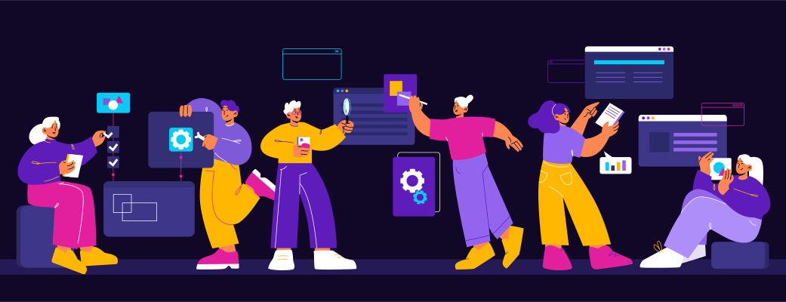

<h3>About Me</h3>

I'm Saeed Yari, a seasoned PHP Backend Developer with over 5 years of experience. I'm passionate about building scalable and efficient solutions using various frameworks and databases.

<h3>My Tech Stack</h3>

#### For Language

#### For Framework

#### For Database (SQL and NoSQL)

#### For Caching

#### For Monitoring

#### For API Gateway

### For Message Queue OR Event

#### For Testing

#### For DevOps

<h3>My GitHub Stat</h3>

<h3>My Contact Info</h3>

